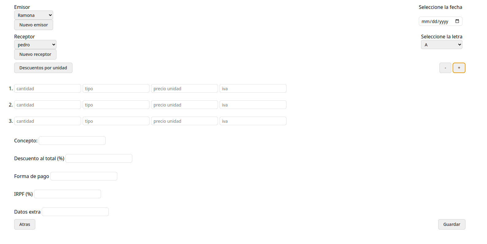

# FACTURACION FACIL

Este repositorio contiene una aplicación para ayudar con la contabilidad de una empresa pequeña o mediana.

## Configuración del Repositorio

Asegúrate de tener instalado Node.js y npm. Luego, ejecuta el script de configuración y elige la versión del archivo dependiendo de tu sistema operativo.

## Dependencias

Deberías tener instalado Edge para Windows y un navegador basado en chromium para Linux.

## Capturas de Pantalla

 
